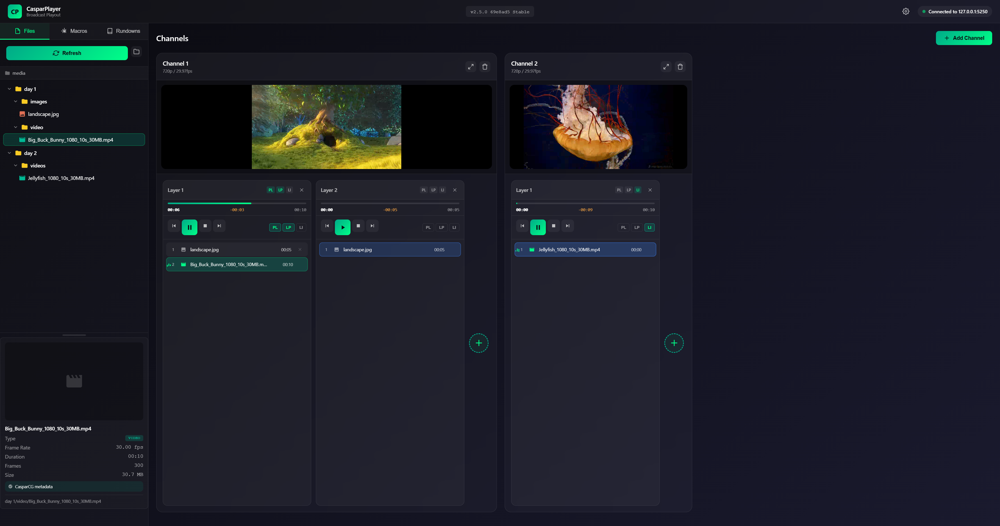

# CasparPlayer

**Professional broadcast playout client for CasparCG Server**

[](LICENSE)
[]()
[](https://www.electronjs.org/)

---

***Fair warning, this app was vibe-coded. It mostly likely has a lot of bad programming and a lot of dead code. It does (mostly) work though, so that is pretty rad***

---



*A modern, dark-themed interface for controlling CasparCG server instances with multi-channel support, live preview, and comprehensive playlist management.*

---

## Features

### Connection Management
- Connect to any CasparCG Server instance (local or network)
- Real-time connection status monitoring
- Configurable AMCP and OSC ports

### Channel & Layer System
- Unlimited channels and layers
- Expandable channel view for detailed control
- Dynamic layer management with add/remove functionality
- Grid-based multi-channel overview

### Playlist Management
- Drag-and-drop media ordering
- Multi-select with Shift+Click and Ctrl+A
- In/out point trimming for clips
- Undo support (Ctrl+Z)
- Playlist mode option
- Loop playlist option
- Loop item option

### Playback Control
- Play, pause, stop controls per layer
- Next/previous item navigation
- Real-time time display (current / duration)

### Live Preview
- MPEG-TS streaming from CasparCG
- Hardware-accelerated playback via mpegts.js
- Per-channel preview windows
- Configurable stream settings (resolution, quality, encoding preset)
- Configurable buffer size (1-30 seconds, default 15)
- Auto-connect option when loading rundowns

### External Control API
- HTTP REST API for external application control
- WebSocket support for external application control and real-time state updates
- Configurable API port
- Available endpoints:
  - `POST /api/command` - Execute commands
  - `GET /api/state` - Get current state
  - `GET /api/status` - Get server status
  - `GET /api/commands` - List available commands

### OSC Integration
- Real-time time and frame updates from CasparCG
- Accurate progress tracking
- Low-latency feedback

### Media Browser
- File tree navigation
- Thumbnail previews (via CasparCG thumbnail generation)
- Media metadata display (duration, resolution)
- Drag media directly to layers

### Macro System
- Create custom server command sequences
- Client-side automation commands (delays, conditionals)
- Save and organize macros
- Quick execution from sidebar
- **Macro Scheduling:**
  - Attach macros to playlist items (start/end triggers)
  - Timecode-based offsets (HH:MM:SS:FF)
  - Negative offsets execute before trigger point
  - Positive offsets execute after trigger point
  - Automatic cancellation when items are stopped

### Rundown Management
- Save complete session state
- Load previous rundowns
- Export/import configurations

### Keyboard Shortcuts
| Shortcut | Action |
|----------|--------|
| `Delete` | Remove selected items |
| `Ctrl+Z` | Undo last action |
| `Ctrl+A` | Select all items in playlist |
| `Shift+Click` | Multi-select range |

---

## Installation

### Prerequisites

- **Node.js** 18.0 or higher
- **CasparCG Server** 2.3.0 or higher (running and accessible)

### Setup

1. **Clone the repository:**
   ```bash
   git clone https://github.com/yourusername/casparplayer.git
   cd casparplayer
   ```

2. **Install dependencies:**
   ```bash
   npm install
   ```

3. **Build and run:**
   ```bash
   npm start
   ```

### Development Mode

For development with auto-reload on file changes:

```bash
npm run dev
```

Or run webpack watch and Electron separately:

```bash
npm run webpack:watch
# In another terminal:
electron .
```

---

## Quick Start

1. **Start CasparCG Server** - Ensure your CasparCG server is running

2. **Launch CasparPlayer** - Run `npm start` or launch the built application

3. **Connect to Server**
   - Click the connection status indicator in the header
   - Enter your server details (default: `127.0.0.1:5250`)
   - Click Connect

4. **Add a Channel**
   - Click the "+" button in the channels area
   - A new channel appears in the grid

5. **Add Media**
   - Navigate the file browser in the sidebar
   - Drag media files to a layer, or double-click to add

6. **Control Playback**
   - Use the play/pause/stop controls on each layer
   - Monitor progress in real-time

---

## Configuration

### Connection Settings

Default connection values:
- **Host:** `127.0.0.1`
- **AMCP Port:** `5250`
- **OSC Port:** `6250`

### Preview Settings

CasparPlayer streams live preview directly from CasparCG using MPEG-TS. No manual CasparCG configuration needed - the app sends ADD STREAM commands automatically.

**Preview options (Settings > Preview):**

| Setting | Description | Default |
|---------|-------------|---------|
| Preview Quality | Video quality (0-100%) | 50% |
| Preview Port | Base port for stream relay | 9250 |
| Preview Resolution | Output resolution | 384x216 |
| Encoding Preset | x264 encoding speed | Ultrafast |
| Encoding Tune | x264 tuning | Zero Latency |
| Buffer Size | Seconds of video to buffer (1-30) | 15 |
| Auto-Connect | Connect previews on rundown load | Off |

**Buffer Size guidance:**
- **Higher values (10-15):** Smoother playback, more delay
- **Lower values (2-5):** Less delay, may stutter on slow connections

### External API Settings

Enable the HTTP/WebSocket API in Settings > API to allow external control:

| Setting | Description | Default |
|---------|-------------|---------|
| Enable API | Turn on/off the control server | Off |
| API Port | HTTP/WebSocket server port | 8088 |

### Config File Location

Settings are stored at:
- **Windows:** `%USERPROFILE%\.casparcg-client\config.json`
- **macOS/Linux:** `~/.casparcg-client/config.json`

---

## Building for Distribution

Build standalone applications for distribution:

```bash
# Windows (NSIS installer)
npm run build:win

# macOS (DMG)
npm run build:mac

# Linux (AppImage)
npm run build:linux
```

Built applications are output to the `dist/` folder.

---

## Tech Stack

| Component | Technology |
|-----------|------------|
| Framework | Electron 35 |
| UI Library | React 18 |
| CasparCG Protocol | casparcg-connection 6.3 |
| Video Streaming | mpegts.js 1.8 |
| OSC Communication | node-osc 9.1 |
| Build Tool | Webpack 5 |
| Styling | CSS with glassmorphism effects |

---

## Project Structure

```
casparplayer/
├── src/
│   ├── main/
│   │   └── main.js              # Electron main process
│   └── renderer/
│       ├── components/          # React UI components
│       ├── context/             # React Context state management
│       ├── services/            # CasparCG commands, utilities
│       └── styles/              # Global CSS
├── public/
│   ├── index.html
│   └── bundle.js                # Webpack output
├── package.json
└── webpack.config.js
```

---

## License

This project is licensed under the MIT License - see the [LICENSE](LICENSE) file for details.

---

## Contributing

Contributions are welcome! Please feel free to submit issues and pull requests.

1. Fork the repository
2. Create a feature branch (`git checkout -b feature/amazing-feature`)
3. Commit your changes (`git commit -m 'Add amazing feature'`)
4. Push to the branch (`git push origin feature/amazing-feature`)
5. Open a Pull Request

---

## Acknowledgments

- [CasparCG](https://casparcg.com/) - Professional broadcast graphics and video playout
- [casparcg-connection](https://github.com/SuperFlyTV/casparcg-connection) - Node.js library for CasparCG
- [mpegts.js](https://github.com/nicholasruunu/nicholasruunu) - MPEG-TS stream player
